## Log

#### 2021-05-23
Последний запуск (считаю с меньшим snr на 10 последовательностях по 10 матриц) MMNet+MMNet+sum_layers
`python3 newOnlineTraining.py --x-size 32 --y-size 64 --snr-min 11 --snr-max 16 --layers 10 -lr 1e-3 --batch-size 500 --train-iterations 1000 --test-iterations 4  --mod QAM_16 --test-batch-size 1000 --linear MMNet --denoiser MMNet --loss-type sum_layers  --output-dir ./ --data --channels-dir ./H_10seq_10matrices-notso2.npy`

Строчка, которая генерит матрицы: 
`python3 offlineTraining.py  --x-size 32 --y-size 64 --snr-min 18 --snr-max 23 --layers 10 -lr 1e-3 --batch-size 10 --train-iterations 1 --mod QAM_16  --test-batch-size 10 --linear MMNet  --denoiser MMNet --test-every 1 --correlated-h --just-save-h H_10seq_10matr_sqrt.npy`
batch_size отвечает за количество матриц в последовательности. Количество последовательностей в коде.


#### 2021-05-03
Заработал новый online-training, запускать так 
`python3 newOnlineTraining.py --x-size 32 --y-size 64 --snr-min 11 --snr-max 16 --layers 10 -lr 1e-3 --batch-size 50 --train-iterations 1 --test-iterations 5  --mod QAM_16 --test-batch-size 50 --linear MMNet_iid --denoiser featurous_nn_simplified --loss-type mse --test-every 100  --output-dir ./ --data --channels-dir ./H_correlated.csv --load-data-from-csv --num-channel-samples 400`
коммит https://github.com/maryruby/MMNet/commit/d744149c05cc378c4731f899fd02a13d667878ef

#### 2021-03-22

Написан corr_H, в котором создается коррелированная по времени и меж-антенно матрица H. Удалось внедрить в общий код так, чтобы он не падал, но обучить при этом сетку не получается. SER остается равен 0.5. Причем при mse тоже, то есть проблема чисто в матрицах.
Есть вопросы к α, β, какими они должны быть? Надо еще раз внимательно на свежую голову проверить размерности и что на что и как перемножается. А так же при обучении переключиться с ΜΜΝet-iid на MMNet, проверить его работоспособность.


#### 2020-11-27
Довожу до ума данные, чтобы закончить статью.
Таблица, которая получилась (энергетический проигрыш - это расстояние по одному уровню по горизонтали, уровень я выбрала 10<sup>-3</sup>, аппроксимирую прямой в логарифмическом масштабе):
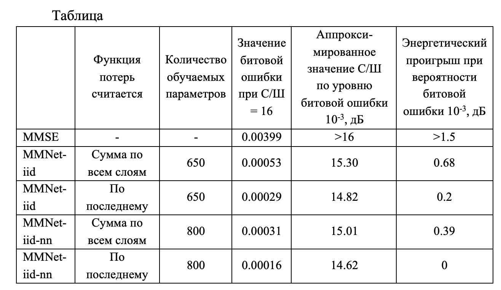 

И сводный график лучшего пока варианта - MMNet-iid c denoiser'ом featurous_nn и оптимизацией ошибки по последнему слою:
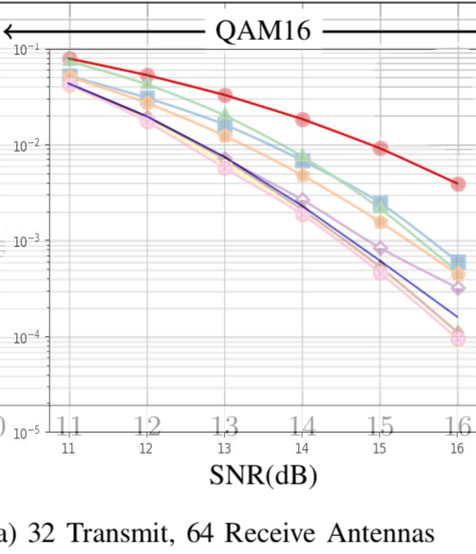 
Видно, на сколько мы приблизились к методу максимального правдоподобия.


#### 2020-11-26
Дорисовала график MMNet-iid c denoiser'ом MMNet и ошибкой, считающейся только по последнему слою для комплекта к предыдущим.
`python3 offlineTraining.py --x-size 32 --y-size 64 --snr-min 11 --snr-max 16 --layers 10 -lr 1e-3 --batch-size 500 --train-iterations 10000 --mod QAM_16 --test-batch-size 5000 --linear MMNet_iid --denoiser MMNet --loss-type mse --test-every 100 --log-file result1.json`
(ревизия https://github.com/maryruby/MMNet/commit/46b2f95a1925a2b65f1a03ef38fce3119c64d1ca) 
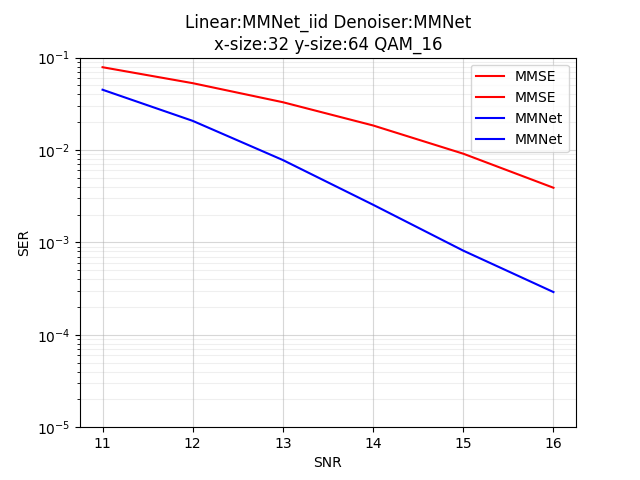 

#### 2020-11-23
Перешла к системам 32х64. Интересно было протестировать различия. 
Сегодня три интересных графика:
1. "Честный" график MMNet-iid c denoiser MMNet. Обучен стандартно (batch = 500, iterations = 10000), строка запуска:
`python3 grid_search.py  --x-size 32 --y-size 64 --snr-min 11 --snr-max 16 --layers 10 -lr 1e-3 --batch-size 500 --train-iterations 10000 --mod QAM_16  --test-batch-size 100000  --test-every 100` 
(ревизия https://github.com/maryruby/MMNet/commit/46b2f95a1925a2b65f1a03ef38fce3119c64d1ca) 
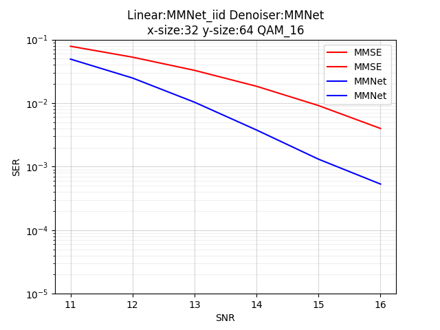 

2. График MMNet-iid c denoiser featurous_nn. Обучен стандартно (batch = 500, iterations = 10000), строка запуска:
`python3 grid_search.py  --x-size 32 --y-size 64 --snr-min 11 --snr-max 16 --layers 10 -lr 1e-3 --batch-size 500 --train-iterations 10000 --mod QAM_16  --test-batch-size 100000  --test-every 100` 
(ревизия https://github.com/maryruby/MMNet/commit/46b2f95a1925a2b65f1a03ef38fce3119c64d1ca)
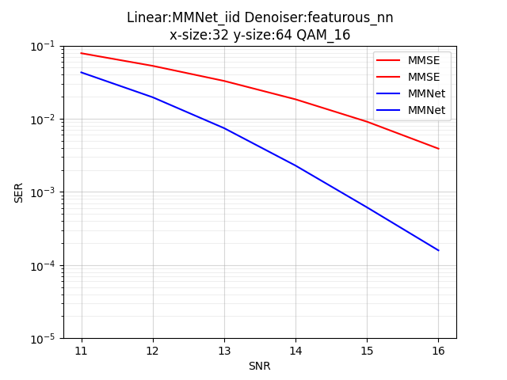 

3. График MMNet-iid c denoiser featurous_nn и ошибкой mse, которая считается только по последнему слою. Обучен стандартно, строка запуска:
`python3 offlineTraining.py --x-size 32 --y-size 64 --snr-min 11 --snr-max 16 --layers 10 -lr 1e-3 --batch-size 500 --train-iterations 10000 --mod QAM_16 --test-batch-size 5000 --linear MMNet_iid --denoiser featurous_nn --loss-type mse --test-every 100 --log-file result1.json`
(ревизия https://github.com/maryruby/MMNet/commit/46b2f95a1925a2b65f1a03ef38fce3119c64d1ca)
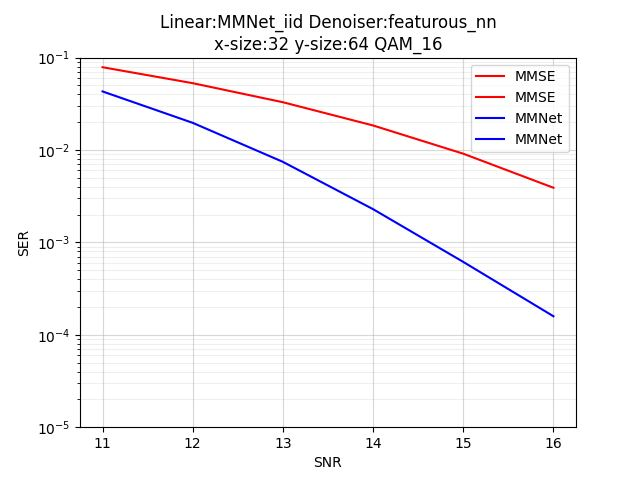


Анализируя эти графики, я пришла к выводу, что описание в статье не соответствует приведенному у них графику.
Прилагаю его сразу:
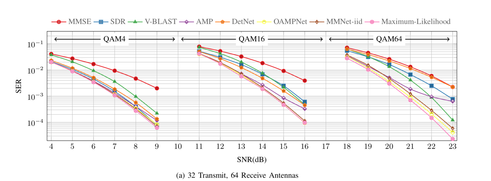

Завтра соберу сводный график.

#### 2020-11-21
Нарисовала более удобный график для сравнения MMNet denoiser и featurous_nn:
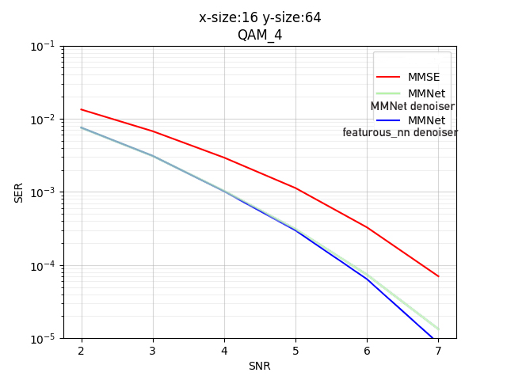 
 
Продолжила исследования замены denoiser'ов. Сегодня в рамках QAM_16. Сводный график сравнения лучшего варианта (featurous_nn) c дефолтным MMNet представлена на графике.
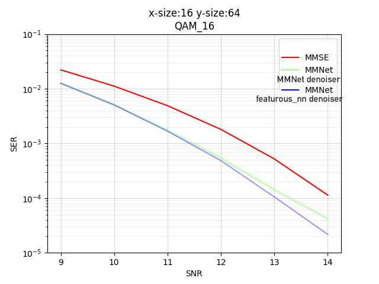 

А вот для QAM_64 так красиво уже не вышло. График сравнения denoiser'ов featurous_nn и MMNet:
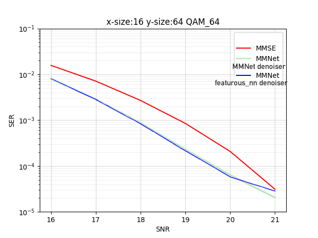 

Чуть лучше denoiser'а MMNet показал себя при QAM_64 denoiser OAMPNet. Совсем незначительно.

#### 2020-11-20
Работает grid_search.py (ревизия https://github.com/maryruby/MMNet/commit/1fa8cc1366985eab86fe2f97618ff6588079ed5f)
`python3 grid_search.py --x-size 16 --y-size 64 --snr-min 2 --snr-max 7 --layers 10 -lr 1e-3 --batch-size 500 --train-iterations 10000 --mod QAM_4  --test-batch-size 5000 --test-every 100`
Зафиксирован linear MMNet_iid, перебираю всевозможные denoiser-ы. Шалость удалась — парочка из них, featurous_nn и OAMPNet дают в хвостике результат чуть лучше соответствующего MMNet.
Графики прилагаю в порядке улучшения:
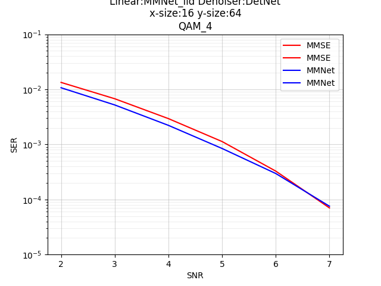 
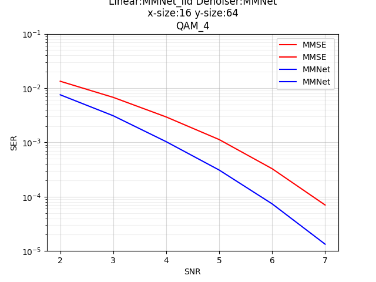

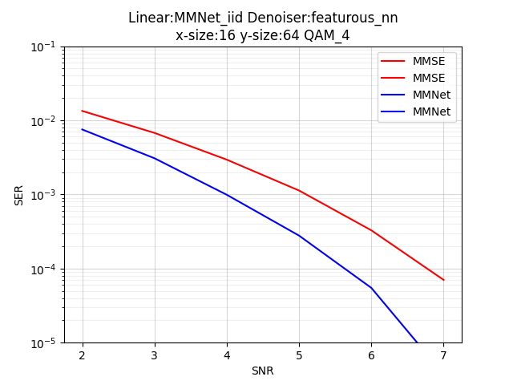

#### 2020-11-19
1. Работает запуск offlineTraining (ревизия https://github.com/maryruby/MMNet/commit/9672acced33b31b217d7edda36711dbbc9902245)
`python3 offlineTraining.py  --x-size 32 --y-size 64 --snr-min 18 --snr-max 23 --layers 10 -lr 1e-3 --batch-size 500 --train-iterations 10000 --mod QAM_64  --test-batch-size 5000 --linear MMNet_iid --denoiser MMNet --test-every 100` 
2. Обучила также как в статье batch-size 500, 10000 итераций. В первых двух MMNet у меня даже чуть лучше вышло в хвосте, в последнем чуть хуже. MMSE везде идеально совпал.
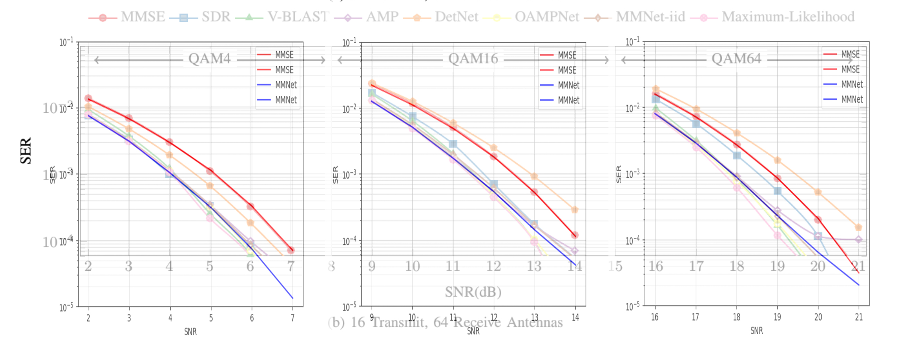

#### 2020-10-05
1. Научились генерить входные данные через `generate1.m` (то же, что и в `generate.m`, только размерности поменьше. Исходный `generate.m` занимал 32 гига памяти и падал)
2. Форкнули репозиторий
3. Переписали чтение данных. Родное не работало, хотело `np.load` делать из директории (но что за директория?)
4. Уперлись в ошибку несоответствия размерностей

Запускать так:
`python3 onlineTraining.py  --x-size 1 --y-size 8 --snr-min 10 --snr-max 15 --layers 10 -lr 1e-3 --batch-size 500 --train-iterations 1000 --mod QAM_4  --test-batch-size 5000 --linear MMNet  --denoiser MMNet --data --channels-dir ../../channel_sequences.hdf5 --output-dir output --saveas model --num-channel-samples 10`

Ошибка:
```
ITERATION 0
Feed dict: {<tf.Tensor 'batch_size:0' shape=() dtype=int32>: 500, <tf.Tensor 'lr:0' shape=() dtype=float32>: 0.001, <tf.Tensor 'snr_db_max:0' shape=() dtype=float32>: 15.0, <tf.Tensor 'snr_db_min:0' shape=() dtype=float32>: 10.0}
Train data shape: (500, 256, 128, 8, 10)
Traceback (most recent call last):
  File "onlineTraining.py", line 67, in <module>
    sess.run(train, feed_dict)
  File "/usr/local/lib/python3.7/site-packages/tensorflow/python/client/session.py", line 958, in run
    run_metadata_ptr)
  File "/usr/local/lib/python3.7/site-packages/tensorflow/python/client/session.py", line 1157, in _run
    (np_val.shape, subfeed_t.name, str(subfeed_t.get_shape())))
ValueError: Cannot feed value of shape (500, 256, 128, 8, 10) for Tensor 'H:0', which has shape '(?, 16, 2)'

```

#### To be continued...